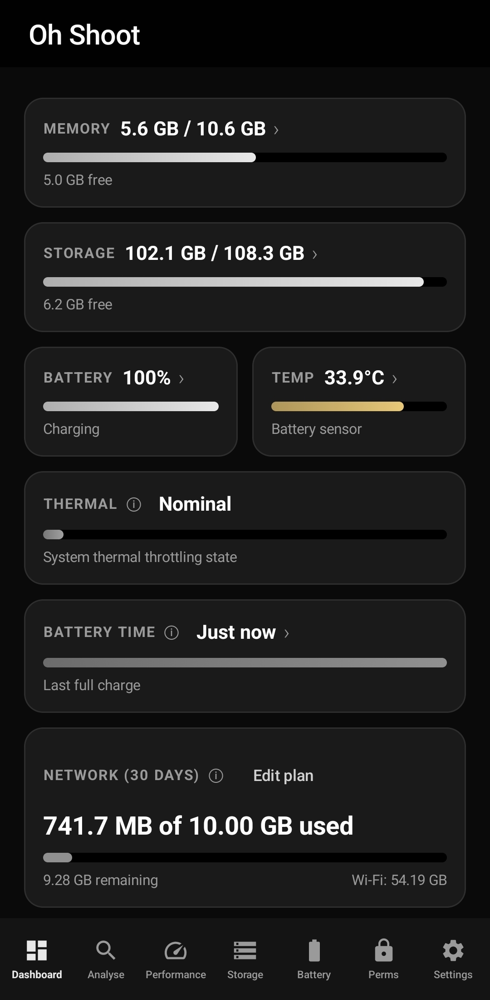
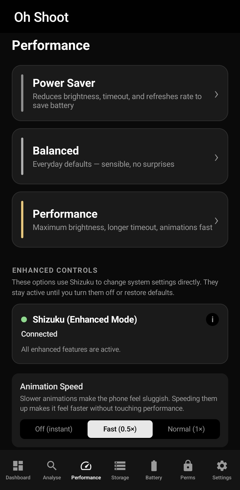
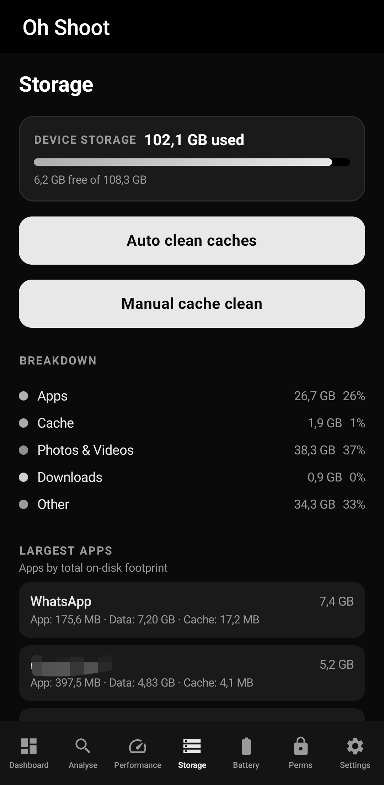
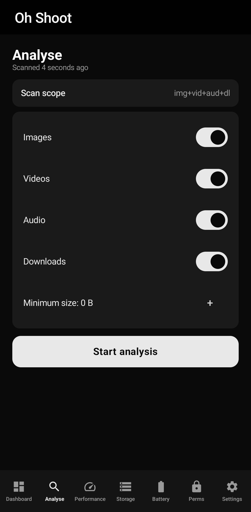
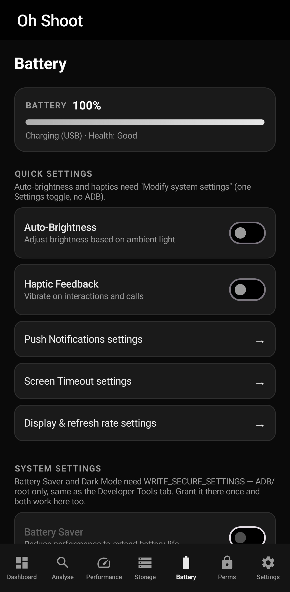
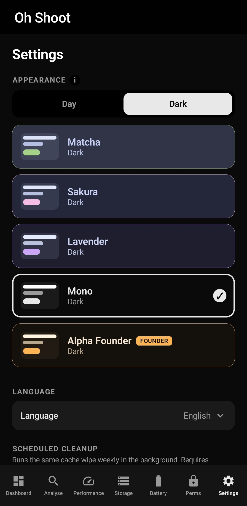

<div align="center">


# OhShootCleaner

**One-tap cleanup and system diagnostics for Android.**  
No root. No fake progress bars. Real control.

[](https://opensource.org/licenses/MIT)
[](https://developer.android.com)
[](https://kotlinlang.org)
[](https://developer.android.com/jetpack/compose)

</div>

---

## Screenshots

<div align="center">

| Dashboard | Performance | Storage |
|:---:|:---:|:---:|
|  |  |  |

| Analysis | Battery | Settings |
|:---:|:---:|:---:|
|  |  |  |

</div>

---

## What it does

**OhShootCleaner** cleans what standard apps can reach, uses Android Accessibility to clear app caches, and integrates with Shizuku to unlock system-level controls without root.

* **Smart Cache Cleaning:** Clears internal and WebView caches directly, plus automated app cache clearing using Accessibility services.
* **Shizuku Integration:** Unlocks power features like force-stopping apps, managing background processes, and tweaking secure system settings.
* **Storage Analysis:** Scans for duplicate files, identifies large waste, and breaks down storage usage line by line.
* **Network & Stats Tracking:** Monitors real-time network usage, live RAM stats, thermal metrics, and battery health.
* **Direct System Access:** Quick shortcuts and deep links straight to OS settings when manual control is needed.

---

## How it works

Standard Android sandboxing limits basic apps from touching other apps' data. OhShootCleaner bridges that gap using legitimate system tools:

* **Basic Mode:** Works out of the box to clear app/WebView cache, track stats, scan duplicates, and release background RAM.
* **Accessibility Mode:** Automates UI actions to clear cache across third-party apps automatically.
* **Shizuku Mode:** Connects to system APIs for direct force-stops, background process limits, and secure setting adjustments without rooting your device.

No fake animations or inflated numbers, just honest stats before and after every action.

---

## Features

| | |
|---|---|
| **Dashboard** | Live memory, storage, battery, thermal, network, CPU stats |
| **One-Tap Boost** | Frees this app's cache and evicts background processes |
| **Storage** | Per-app sizes, cache breakdown, duplicate finder, big-file scanner |
| **Analysis** | Duplicates, large files, unused apps, media scope picker |
| **Performance** | Power Saver / Balanced / Performance presets |
| **Battery** | Health, temperature, charge estimation, quick settings |
| **Themes** | Six flavors: Latte, Matcha, Sakura, Lavender, Mono, Alpha Founder |
| **Languages** | English, German, Spanish, French, Italian, Portuguese, Russian |
| **Widgets** | Home-screen cleaner, dashboard, data usage |
| **Shortcuts** | Quick-settings tile and long-press launcher shortcuts |

---

## Install

| Source | Status |
|---|---|
| **GitHub Releases** | [Download the latest APK](https://github.com/bamBi4k/oshootcleaner/releases) |
| **F-Droid** | Coming soon |
| **Google Play** | Coming soon |

Requires **Android 8.0 (API 26)** or newer.

---

## Build from source

```bash
git clone https://github.com/bamBi4k/oshootcleaner.git
cd oshootcleaner
./gradlew assembleDebug
```
